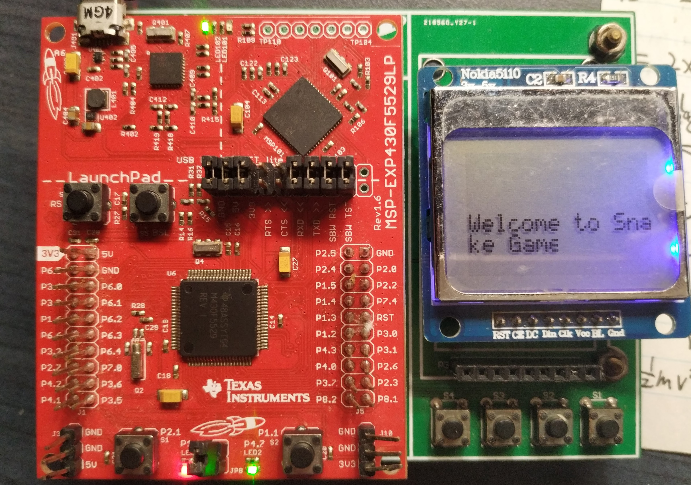
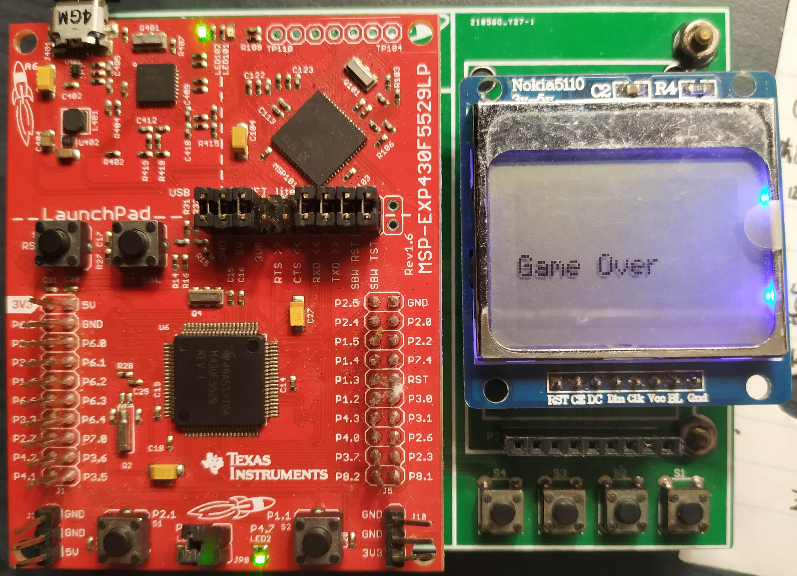

# MSP430 gluttonous snake
This is a project based on MSP430F5229 LaunchPad, and it implements a gluttonous snake game and has a score system there, the display module is LCD 5110. It uses TI-RTOS and snake moving part was writhen in C++. In this project, you can easily set the amount of food, and the food position is generated randomly.

## Connection

| Pin (LCD5110)   |  MSP430F5529    |
|---------------|:-----:|
| Reset         |  P3.7 |
| Chip Select   |  P2.5 |  
| Data/Command  |  P2.4 |
| Data Input    |  P8.1 |
| Clock         |  P8.2 |
 
MSP430F5529 Button Connection:

| Buttons   |  MSP430F5529    |
|-----------|:-----:|
| Right (S1)    |  P1.4 |
| Down (S2)    |  P1.3 |
| Up (S3)    |  P1.2 |
| Left (S4)       |  P4.3 |

## Photos of the project

    
     
    
Start Screen

    
     
    
In the Game

    
     
    
Game Over

